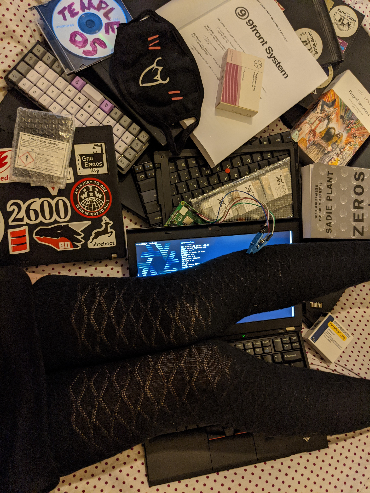

#The allegations are true

Your eyes haven't deceived you. 
You may know me by a variety of names and faces, but there's one thing that remains consistent across all my identities regardless of the mask I wear - and that is that I'm gay and autistic.

---

"_A society of free people will always have crime, violence and social disruption. It will never be completely safe. The alternative is a police state. A police state can give you safe streets, but only at the price of your human spirit. [...] I am a sovereign state, and I feel that my borders are far more sacred than the politically drawn boundaries of any country._"

\- Alexander Shulgin, PiHKAL

---

*_The stories and information posted here are artistic works of fiction and falsehood. Only a fool would take anything posted here as fact._*

